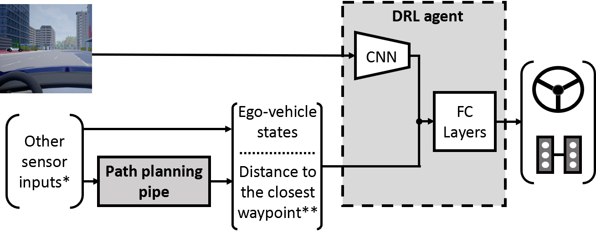

# A Hybrid Deep Reinforcement Learning Based Automated Driving Agent for CARLA

Codebase for our Hybrid Deep Reinforcement Learning (H-DRL) based automated driving project.
The related paper can be accessed with [this](https://arxiv.org/pdf/2002.00434.pdf) link.

If you find the code useful for your research, please consider citing our paper:

      @inproceedings{yurtsever2020integrating,
        title={Integrating deep reinforcement learning with model-based path planners for automated driving},
        author={Yurtsever, Ekim and Capito, Linda and Redmill, Keith and Ozguner, Umit},
        booktitle={2020 IEEE Intelligent Vehicles Symposium (IV)},
        pages={1311--1316},
        year={2020},
        organization={IEEE}
      }

> Yurtsever, E., Capito, L., Redmill, K., & Ozguner, U. (2020, June). Integrating deep reinforcement learning with model-based path planners for automated driving. In 2020 IEEE Intelligent Vehicles Symposium (IV) (pp. 1311-1316). IEEE.

## Work in progress. Stay tuned for the full release.

## Overview

 

An overview of our framework. The proposed system is a hybrid of a model-based planner and a model-free DRL agent. *Other sensor inputs can be anything the conventional pipe needs. ** We integrate model-based planners into the DRL agent by adding "distance to the closest waypoint" to our state-space, where the path planner gives the closest waypoint. Furthermore, the reward function is modified accordingly: the agent is penalized for straying away from the model-based planners' waypoints and also making a collision. Any kind of path planner can be integrated into the DRL agent with the proposed method.

## Installation

## Credits
This project was forked from a conventional DRL implementation for CARLA by Sentdex. https://github.com/Sentdex/Carla-RL
